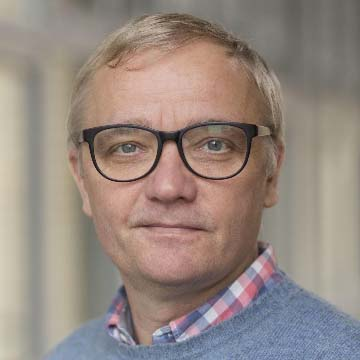

# Curriculum Vitae

# Name: Simon Worthington

DOB & place 15. Nov. 1966, Manchester UK

Nationality UK British

E-Mail: <simon.worthington@tib.eu>

GitHub: <https://github.com/mrchristian>

Mastodon: <a rel="me" href="https://openbiblio.social/@mrchristian">mrchristian@openbibio.social</a>

Twitter: [\@mrchristian99](https://twitter.com/mrchristian99)

Matrix chat: [@mrchristian99:matrix.org](https://matrix.to/#/@mrchristian99:matrix.org)

Tel: 00 49 (0)174 877 1599

ORCID: [0000-0002-8579-9717](https://orcid.org/0000-0002-8579-9717)

Languages English (native), German (A2)

**Specialization: \#bookliberationist - Publishing software architect**

## Profile

Simon’s work has been dedicated to lowering barriers to publishing and reading
of scholarly works through developing free and open source software to
disintermediate current publishers workflows by introducing efficiency,
automation, and interoperability.

Initially in 2005 the focus of the software investigation was single source to
multi-format typesetting and more recently: microservices, content real-time
validation with Continuous Integration (CI), Infrastructure as code (IasC), and
increasing interoperability with the implementation of frameworks such as the
JATS standard — Manuscript Exchange Common Approach (MECA). See:
<https://www.niso.org/standards-committees/meca>.

**Skill sets:** Software product owner → Full-stack web developer → UX/UI design
research and visual design → Research team leader → Publisher & editor → Open
Science & FOSS advocate → Publishing company founder & director → Serial startup
founder.

## Employment

**2017- current: TIB – German National Library of Science and Technology**

Editor-in-chief for *Generation Research* (<https://genr.eu/>) editorial
platform for Open Science for the Leibniz Research Alliance, Open Science. Lead
on ADA software development research project for publishing microservices
software development.

**2017: Akademienunion – Berlin-Brandenburg Academy of Sciences and Humanities**  
Report co-author for project *AGATE* – scoping technical API networking to
connect archives of all of Europe’s 600+ academies of arts & science.

**2015-17 Director Research and Development, Hybrid Publishing Group, Berlin.**
Company founder.

Digital publishing product RnD company. Specializing in modularization of free
and open source technologies such as le-tex’s XPROC based multi-format
publishing stack, and Vivliostyle browser based PDF rendering. The company
coordinates a network of development companies and organizations to improve
engineering quality of publishing infrastructures. Member of the Börsenverein
des Deutschen Buchhandels, Startup Club.

**2012-15: Hybrid Publishing Consortium, Leuphana Universität**

Research team leader in an EU funded business incubator with team of six for the
Hybrid Publishing Consortium (HPC). The objective was to productise the
open-source tech stack for multi-format scholarly publishing. A number of
successful platform prototypes were developed – portfolio:
<https://hpg.io/portfolio.pdf>.

**1994-2012: Mute Publishing**

Company co-founder and co-Director, publisher and editor, Director of Digital
for platform delivery. Mute has published over 8.000 OA academic articles, circa
100 books and produced multiple free and open source software platforms, such as
print-on-demand services, virtualized web publishing tools running over 10.000
user websites, three rounds of R&D on multi-format web typesetting platforms,
online courier distribution networks and global printing & digital distribution
systems, and more. See: <https://metamute.org/>.

**2009-11: Art of Digital London**

Digital strategy professional training course design and workshop delivery with
IT4Arts as a ‘peer-learning-network’ for Arts Council England’s 275 funded
organisations in London.

**2006-10: MiniBar Lab Ventures London, co-founder and analyst** – Europe’s
largest social entrepreneur tech-startup network with over 7.000 members.

**1998-99: Paisley-University, Scotland** – developer and research in VR.

**1996-97: The Bartlett School of Architecture, UCL** – Computer lab developer
and instructor.

**1995-98: Artifice Magazine, Black Dog Publishing, London** – Multimedia CD-Rom
Producer / coder.

## Startups (founding dates)

**RunStop** – 2018, microcomputer hosted publishing services; **Berlin
Publishing School** – 2017, multi-format publishing training courses; **InfoMesh
Technologies UG** – 2015, publishing software; **Typestr** – **2011**, GDocs to
multi-format typesetting platform; **More-is-More** – 2007, publishing P2P
physical distribution service; **Web-2-PoD** – 2005, web platform for
print-on-demand; **OpenMute – 2002**, web publishing tools virtual services
platform; and **YouAreHere** – **2002**, Freifunk delivered media
publishing**.**

## Education and qualifications

-   **Deutsch für den Beruf** – Inlingua, level A2, 2016

-   **California Institute of the Arts, California USA** – MFA Art 1992-93 (not
    complete)

-   **Slade School of Fine Arts, UCL** – BA Honours. Fine Art 1989-92

-   **Falmouth College of Art and Design, Cornwall UK** – Arts Foundation
    1988-89

## Skills

Software development: PHP/MySQL for CMSs; CMS admin, development, and
maintenance — OJS, Wordpress, and Drupal; Full-stack web developer; Web design;
Linux command line; Linux system admin and network management; XML/XPROC; XSLT;
JATS; HTML5; SASS/CSS/Paginated CSS; R; Git/GitHub/GitLab; Jekyll/Hugo/GitHub
Pages; Ruby; Javascript; APIs; CRM use; Raspberry Pi and Microcomputer OSs; and
UX/UI processes.

Publishing: Editor; Copy editor and proofer; Journal and book publication
management; Production manager; pricing and sales; Multi-format publishing;
Metadata management; Contract writing; Art director; Distribution; and SEO and
analytics.

Project management and product owner: Technical writing - manuals, guides,
plans, and user docs; Agile techniques; Team learning, skilling, and knowledge
retention; and Project tool sets: Trackers, CRMs, reporting, and Gantt charts.

Research: Design research; Funding application writing; Team development and
management; Working group leading; Workshop management; and Event management.

Management: HR and recruiting; Management reporting and financial reporting;
Business plan writing and financial projects; Sales development; Digital
strategy development and monitoring; Company law, accountancy, and reporting.

## Voluntary and associate positions (current)

-   **LIBER, Citizen Science Working Group, Secretary, 2019-21.** Also
    responsible for leading a new publication ‘An International Guide for
    Research Libraries on Citizen Science’.

-   **FORCE11, Board of Directors Member, 2019-21.** Responsible for developing
    digital strategy and delivering new web platform, with new platform for
    Force11 conference and summer school to launch 2020.

-   **Open Science MOOC, Contributor, 2018-ongoing.** Contributor to module
    ‘Module 5 Open Research Software and Open Source’.

-   **Goldsmith University Press (MIT), Advisory board, 2017-ongoing.** Input
    consultation to MITs new FOSS OA platform, 2019.

-   **Drucken Heften Laden: Berlin small publishers network, Member,
    2016-ongoing.** See PaperNews <https://papernews.ink/>.

-   **Mute Magazine – Editorial collective member, 2012-ongoing.**

## Publications & software (selection)

See all publications, code, and projects:
<https://www.zotero.org/mrchristian/cv>

### Publications

Worthington, Simon, Lisa Nöth, and Johannes Amorosa. ‘ADA — Phases of
Development: Proof of Concept to Community Handover – an Interoperable Framework
for Microservices in Scholarly Publishing’, 1 August 2019.
<https://doi.org/10.5281/zenodo.3626810>.

Research Report - Wuttke, Ulrike, Carolin Ott, Dominik Adrian, and Simon
Worthington. ‘AGATE: Concept for a European Academies Internet Gateway for the
Humanities and Social Sciences’. Zenodo, 22 June 2017.
<https://doi.org/10.5281/zenodo.815916>.

Book - Worthington, S., (2015). *Book to the Future: a Manifesto for Book
Liberation*. s.l.: Hybrid Publishing Consortium.
<https://zenodo.org/record/18166>.

Journal Article - Worthington, S., Zehle, S., (2016). *Network Ecologies:
Archive Architectures*. (n.d.). Retrieved August 11, 2016,
<http://scalar.usc.edu/works/network-ecologies/archive-architectures>.

Worthington, Simon, and Kral, Christina. ‘Traces on the Archive’. Research
Repository. HPC Research Repository, 30 April 2015.
<https://research.consortium.io/docs/traces_on_the_archive/traces_on_the_archive.html>.

Worthington, Simon, and Christina Kral. Publication Taxonomy: An Initial Guide
to Academic Publishing Types, inside and beyond Academe. [S.l.]: Mute Publishing
Ltd, 2014.
<https://research.consortium.io/docs/a_publication_taxonomy/a-publication-taxonomy.html>.

Worthington, S., Broekman, P. v. M. (2014). *Open education: a study in
disruption*. London ; New York: Rowman & Littlefield International.
<http://curve.coventry.ac.uk/open/items/c04530ce-d16a-46ca-b359-a905195a76cb/1/>.

Worthington, S., *Dynamic Publishing–New Platforms, New Readers! \| Hybrid
Publishing Consortium. Research plan*, August 2013.
<http://www.consortium.io/research-plan>.

### Code

**ADA Sprint Module: Paginated CSS and multi-format publishing MVP** –
Worthington, Simon, and Jakob Schumacher. ADA Sprint Module MVP:
Akademie-Oeffentliches-Gesundheitswesen/Beta-Buch. HTML. 2019. Reprint, Akademie
für Öffentliches Gesundheitswesen in Düsseldorf, 2019.
<https://github.com/akademie-oeffentliches-gesundheitswesen/Beta-Buch>.

**ADA** – Publishing microservices for scholarly publishing. Including IasC and
Kafka interface. Role: project leader. Hybrid Publishing Consortium – TIB,
Endocode AG, 2018.
.

**TypeSetr** – Google Docs multi-format typesetting. Role: Founder, product
owner and development team. Hybrid Publishing Lab, Leuphana University, 2014.
.

**Collaborative Bibliographies** – Zotero collaborative library builder.
Worthington, Simon, Loraine Furter, and Experimental Media Lab. Collaborative
Libraries (Bibliography) (version beta). Madrid: Role: co-developer. Hybrid
Publishing Group, 2015. <https://github.com/consortium/Collaborative-Libraries>.

**McLuhan Player** – Worthington, Simon. Hybrid Lecture Player - Finally Getting
the Message: McLuhan’s Media Practice, 2015. Player:
<https://mcluhan.consortium.io/> and source
<http://dx.doi.org/10.5281/zenodo.19331>.

**Hybrid Player** – reading interface to synchronise text transcript to original
video. Role: system architect. Hybrid Publishing Group, 2015.
<https://github.com/consortium/hybrid-player>.

**Research Player** – Amorosa, Johannes, and Simon Worthington. Research Player
- Content CI Proof of Concept, 2015.
<https://github.com/consortium/hybrid-publishing-research>.

**Progressive Publishing System** – automated multi-format book typesetting web
service for PoD, eBooks and HTML web-book. Funded by Technology Strategy Board
UK. Role: Founder and system architect. LShift Ltd & OpenMute Ltd, 2012.
<https://www.metamute.org/services/r-d/pps-private-beta-online-.docx-and-google-docs-conversion-to-ebook>.

**More is More** – media distribution, book, magazine, and film international
postal distribution and event management. Funded by Soros Foundation (OSI),
Kennisland NL. Role: System architect. OpenMute NL, 2008.

**Web2POD** – print-on-demand book production & distribution web service. Funder
Arts Council England. Role: system architect. OpenMute, 2005.

**OMWeb** – virtualized XOOPS CMS providing free and paid web publishing tools,
wikis, etc. Serviced over 10.000 websites. Funded by Arts Council England. Role:
founder, business dev, dev team member. OpenMute, 2004.

**Metamute website and infrastructure** – 25 years of continuous independent web
infrastructure hosting and multiple website rebuilds in a variety of platforms.

\--

End, 05.12.2020 12:15:07
